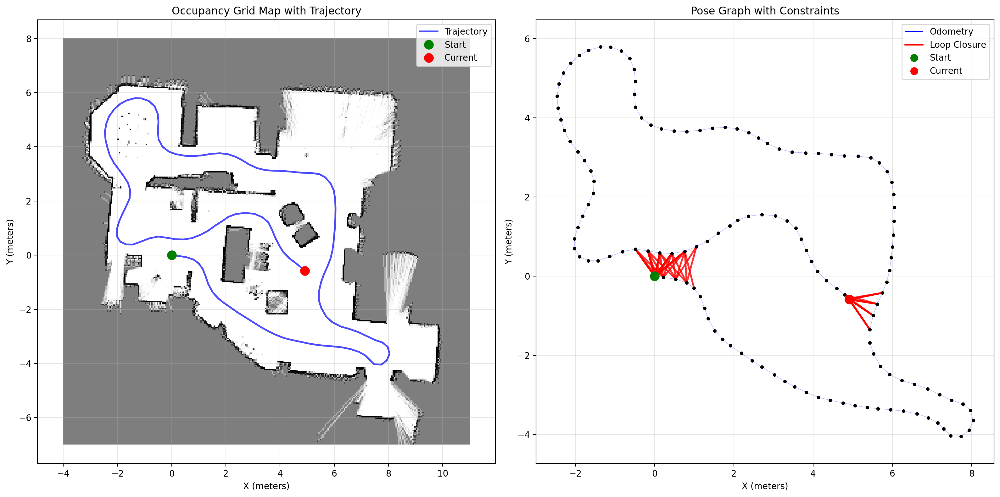

# 2D Graph-Based SLAM

A Python implementation of 2D graph-based SLAM using:
- Point-to-Point ICP for scan matching
- Pose graph optimization
- Loop closure detection
- Occupancy grid mapping

## Features
- Real-time 2D lidar SLAM
- Pose graph with loop closure
- Occupancy grid generation for path planning
- Visualization tools

## Files
- `slam.py` - Main SLAM implementation
- `Scan_Pose_Data/` - Sample datasets

## Requirements
- numpy
- scipy
- matplotlib

## Output



## Add files to post-process raw OGM from SLAM
* Tweak angle to square up alignment
* Add inflatio
```
slam_dev/
├── slam.py                   # SLAM code (includes OGM class)
├── occupancy_grid.py         # New standalone OGM class (with added methods)
├── maps/
│   ├── raw_map.npz           # From SLAM
│   ├── raw_map.png           # Visualization
│   ├── aligned_map.npz       # After rotation
│   ├── final_map.npz         # After rotation + inflation
│   └── final_map.png         # Final visualization
├── diagnostic.py             # Script to examine contents of OGM cells
├── align_auto_pca.py         # Script to process raw map
├── align_manual.py           # Script to process raw map
└── path_planner.py           # Script for path planning
```
